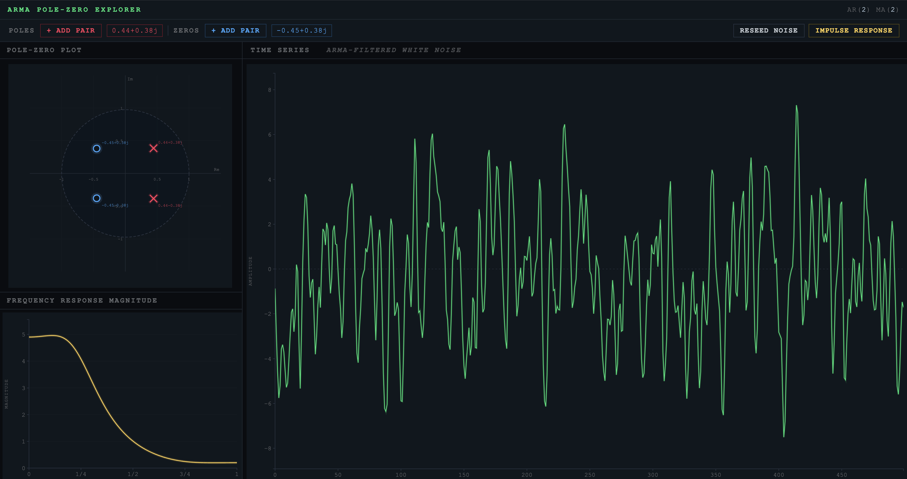

# arma-signal-simulator
Interactive web-based simulator for ARMA(p, q) processes driven by white noise. Poles and zeros (shown inside the unit circle) can be dragged with the mouse to observe effects in frequnecy and time domain response. Built with D3.js. 

App is hosted hosted [here](https://linussgi.github.io/arma-signal-simulator/). Note: For best experience, open link on a desktop browser (not currently mobile friendly).

## Features

The user can explore the effect of pole and zero placement on ARMA processes (and equivalently, any rational transfer function LTI filter in discrete time). The displayed unit circle contains the poles and zeros of the ARMA process. 

- The ARMA process is driven by white noise (IID Gaussian innovation). The noise can be reseeded with the `RESEED NOISE` button.
- The innovation itself can be replaced with a delta train of length $q + 1$ with the `IMPULSE RESPONSE` button. This simulates the impulse response of the ARMA in time (useful if you want to think of the ARMA as an LTI filter on a signal).
- The poles (denoted by red X's) and the zeros (demotes by blue O's) can be dragged around the complex plane, and the discrete time response updates dynamically on the right hand plot.
- Poles and zeros can be added with the `ADD PAIR` buttons. A maximum of 4 poles and 4 zeros can be added and manipulated.
- The magnitude of the frequency response of the system is shown below the unit circle plot. The ticks are marked a multiples of $\pi$ from 0 to 1.

Red crosses and blue circles can be manipulated with the mouse to affect system response.

## Mathematical representation

An ARMA is a constant coefficient difference equation (CCDE) in a general form:

$$\sum \limits^{N}_{k = 0} \phi_k y[n - k] = \sum \limits^{M}_{k = 0} \theta_k x[n - k]$$

The Z-transform of this expression yields a general rational transfer function:

$$H(z) = \frac{b_0 + b_1 z^{-1} + b_2 z^{-2} + \ldots + b_M z^{-M}}{1 + a_1 z^{-1} + a_2 z^{-2} + \ldots + a_N z^{-N}} = \frac{\prod \limits^{M}_{n = 1} (1 - z_n z^{-1})}{\prod \limits^{N}_{n = 1}(1 - p_n z^{-1})}$$

Where $p_n$ are the system poles and $a_m$ are the system zeros. It is these poles and zeros that are plotted on the unit circle plot on the web page. 

To enforce BIBO stability, the poles are consrained to a unit magnitude or smaller. For real valued signals, the poles and zeros always come in complex conjugates, which is why moving one pole in the complex plane will also force its conjugate to move.